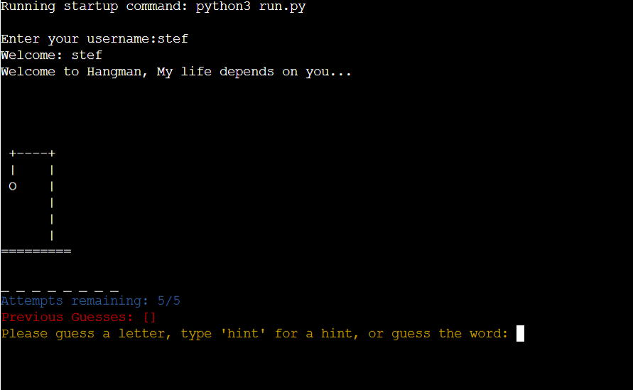

[The live link can be found here](https://hangman32.herokuapp.com/)

Hangman is a classic word-guessing game where one player thinks of a word and the other player tries to guess the word by suggesting letters. I recreated this game in Python, using basic programming concepts like loops, conditional statements, and functions.

## How to play:

- The program picks a random word for the words.py file and then represent each letter of the word with an underscore (_).

- The user starts guessing letters of the word. For each correct guess, the program reveals the letter in the correct position in the word.

- For each incorrect guess, the program prints a graphical part of a "hangman" figure. The figure typically consists of a gallows and a stick figure.

- The game continues until the user guesses the entire word, or the hangman figure is completed.

## Features

### Existing Features

**allowing user to pick username, showing attempts remaining in blue, previous guesses in red and providing an output to the user in yellow font**

**Invalid input message as it only accepts letters**

**Providing one HINT per game**

**Retyping HINT after it has been used and getting back a message stating the hint has been used**

 
 **Keeps track of previous guesses**
 

**Incorrect word guessed try again**

**You lose, correct word is printed out and full hangman image is shown**

**Option to play again. yes option restarts, no option prints a message to the user**

### Future Features

**Different difficulty levels**
I would like to add a function that allows the user to pick between easy, medium or hard.

**Scoreboard**
I would like to add a feature that allows users to view high scores.

## Technology Used

**Languages** - Python.

**Libraries**

[random](https://www.thewordfinder.com/random-word-generator/?msclkid=d948c7d79c351dcc5c07a434482ab5e2) - to select random words.

[colorama](https://pypi.org/project/colorama/) - to change the output font colour.

[freemonogrammaker](https://make.freemonogrammaker.com/bubble-letters-generator/) - to make the hangman bubble writing for this readme.

[Github](https://github.com/) - To save and store the project files for the website.

[Gitpod](https://gitpod.io/workspaces) - Used to deploy the website.

Bugs
Fixed Bugs
Bug: When implementing hangman graphics, lives left did not correspond to amount of stages left in hangman.
Fix: Due to lists iterating from 0, set lives displayed to user as lives + 1 and also adjusted the game over setting for lives >=0
Bug: When testing hangman graphics, the bottom graphic was shifted over to the right.
Fix: Replaced \ with double \\ make \ print to the terminal.
Bug: When on last life, letters guessed and amount of lives fail to show on terminal.
Fix: Set lives to lives >=0 at end of while loop to ensure messages display correctly.
Bug: Hangman graphic not displaying on game over.
Fix: Add in additional stage of hangman graphic. Remove lives + 1 from script, set game over criteria back lives > 0. A more elgant fix for the problem above.
Bug: When selecting view rules. After returning to the main window, if you selected play game it would go to the difficulty menu
Fix: Called main() in game rules rather that initialise_game()
Bug: Error message too long causing last letter to wrap to following line.
Fix: Split up error string and put "Please try again" to a new line.

## Testing

I have manually tested the project by doing the following:
1.Tested python code through code institutes CI Python Linter ([https://pep8ci.herokuapp.com/]) and fixed any errors.

**Showing errors**

**No errors**

2.Manually tested user inputs by purposefully inputing incorrect data to confirm error messages were capturing wrong inputs.

3.I Tested it on both the local terminal and on the deployed site on Heroku.

4.I sent it to several friends to test out and send feedback. 

 
### Deployment
The project was deployed using Code Institutes mock terminal for Heroku.
I followed the below steps using the Code Institute tutorial:
Fork or clone this repository.
Ensure the Procfile is in place.
requirements.txt can be left empty as this project does not use any external libraries.
Create a new app in Heroku.
Select "New" and "Create new app".
Name the new app and click "Create new app".
In "Settings" select "BuildPack" and select Python and Node.js. (Python must be at the top of the list).
Whilst still in "Settings", click "Reveal Config Vars" and input the folloing. KEY: PORT, VALUE: 8000. Nothing else is needed here as this project does not have any sensitive files.
Click on "Deploy" and select your deploy method and repository.
Click "Connect" on selected repository.
Either choose "Enable Automatic Deploys" or "Deploy Branch" in the manual deploy section.
Heroku will now deploy the site.

**How to Fork**
If you would like to make changes to this repositiry without affecting the original you can do so by making a copy.
1. Click the GitHub repository you wish to fork.
2. Click on the fork button located in the top right hand corner.

 **How to clone**
If you would like to download this repository and store it locally you can do so by cloning it
1.Click the GitHub repository.
2.Click on the drop down arrow on the Code button located on the top right.
3.Select and copy the link that appears.
4.Open Gitpod & select the location where you would like the clone to be saved.
5.In the terminal type 'git clone' and paste the link.
6.Press enter to create your local clone.

 

 ## Credits
 
**Code Used**

- [How to create a QUIZ using Html, CSS and Javascript](https://www.youtube.com/watch?v=1ydfKDwsYbU) I Used this youtube video as a guideline for creating my quiz.

- [Build A Quiz App With JavaScript](https://www.youtube.com/watch?v=riDzcEQbX6k) I Used this youtube video as a guideline for creating my quiz.

- [Java cheat sheet](https://htmlcheatsheet.com/js/) I used java cheat sheet when I was unsure about certain code.

 
**Content**

The Home page content was written by Stephanie McMahon. 

I used [education quizzes](https://www.educationquizzes.com/ks2/music/?utm_source=bing&utm_medium=cpc&utm_campaign=EQ%20KS2&utm_term=quizzes%20about%20music&utm_content=Subject%20Music) for the quiz questions.

**Media**

 - [all images throughout the website were downloaded from pexels](https://www.pexels.com/)
 - [the social media icons were taken from font awesome](https://fontawesome.com/)
 
## Acknowledgments

I would like to acknowledge the following people who helped me in completing this project:
- My Course Mentor Harry Dhillon for his support and guidance.
- My friends and family for their support in continuing this project after the death of my grandmother.

Thank you for viewing my project.

 
 
